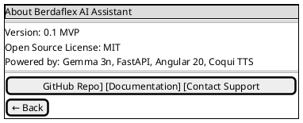

# Docs — Agent Guide (Meteoris Insight)

Purpose: keep **product requirements**, **product vision**, **agentic architecture**, and the **MkDocs** site consistent with each other and with the codebase as it grows.

## What this folder owns

- `PRD.md` — normative FR/NFR, API expectations, milestones, deliverables.
- `VISION.md` — assignment alignment + technical vision (Spring AI Parts 1–7, modules, eval).
- `ARCHITECTURE.md` — detailed engineering architecture (Modulith, data, MCP, agents, API, testing).
- `USE-CASES.md` — all use case IDs in one catalogue.
- `USER-STORIES.md` — agile backlog `US-xx`.
- `FORMS-AND-FLOWS.md` — Thymeleaf forms, routes, REST parallels, E2E workflow narratives, Mermaid diagrams.
- `WIREFRAMES.md` — text-based screen wireframes plus **PlantUML Salt** companions per screen (see *Text wireframes and PlantUML Salt* below).
- `EVALUATION-METHODOLOGY.md` — reproducible eval: versioning, profiles, scoring, JSON reports.
- `IMPLEMENTATION-PLAN-WBS.md` — phased WBS, milestone mapping, Definition of Done.
- `WORK-SCENARIOS.md` — catalogue of possible user, API, agent, memory, eval, and CI scenarios.
- `index.md` — documentation landing page.
- `ai-context-strategy.md` — how AI agents should use `AGENTS.md` + `.agents/skills/`.
- `stylesheets/extra.css` — Material theme layout tweaks.
- Repo-root `mkdocs.yml` — site nav and plugins.

## Commands

```bash
pip install -r requirements-docs.txt
mkdocs serve
mkdocs build -s
```

## Consistency rules

- **Language:** All documentation under `docs/` and all doc edits referenced from MkDocs must be in **English** (see root `AGENTS.md` → **Global boundaries**).
- If implementation **modules or stack** change, update `VISION.md` (especially the Modulith table and memory sections) in the same change set.
- If you add major doc pages, register them in `../mkdocs.yml` `nav:`.
- Prefer **links** to `VISION.md` sections over duplicating long specifications in `index.md`.
- When adding UI/API behaviour specs, update **[WIREFRAMES.md](WIREFRAMES.md)** (screen → regions → controls) and **[FORMS-AND-FLOWS.md](FORMS-AND-FLOWS.md)** (forms and flows) unless the user asks for prose only.

### Text wireframes and PlantUML Salt (required)

- In **[WIREFRAMES.md](WIREFRAMES.md)**, every **text-based screen wireframe** (a **Screen:** heading and its bullet regions: header, main, footer, forms, etc.) **must** be followed **immediately** by a **PlantUML Wireframe** diagram in a fenced `plantuml` code block using **`@startsalt`** … **`@endsalt`**.
- The Salt diagram is a **layout parallel** to the text wireframe: same page title, navigation affordances, sections, primary copy, buttons/links, and optional hints—without inventing controls that the text wireframe does not describe.
- **Text remains the source of truth** for exact wording and control labels; Salt is for quick visual scanning in MkDocs (same `plantuml_markdown` setup as below).
- When you **add a new screen** or **change** an existing wireframe materially, update **both** the text block and the Salt block in the same edit.
- **Retrofit:** older screens that only have text should gain a Salt companion when those sections are next touched.

**Example (reference layout—replace with Meteoris Insight copy):**




## Skills

- `../.agents/skills/core-architecture/SKILL.md`
- `../.agents/skills/api-design/SKILL.md`
- `../.agents/skills/evaluation/SKILL.md`
- `../.agents/skills/repository-design/SKILL.md`
