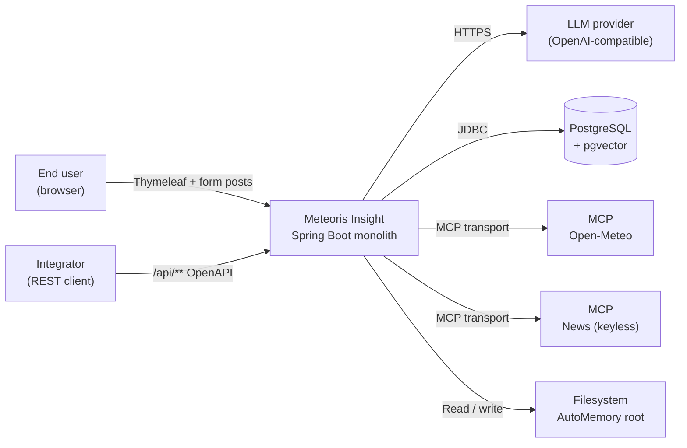
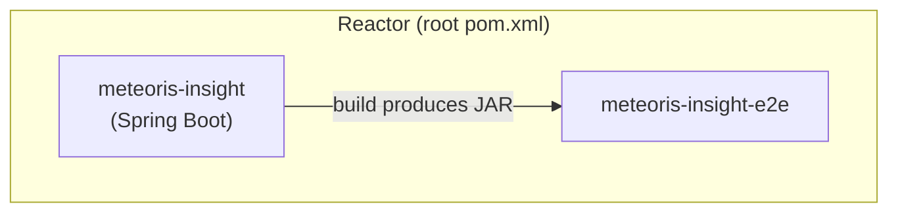
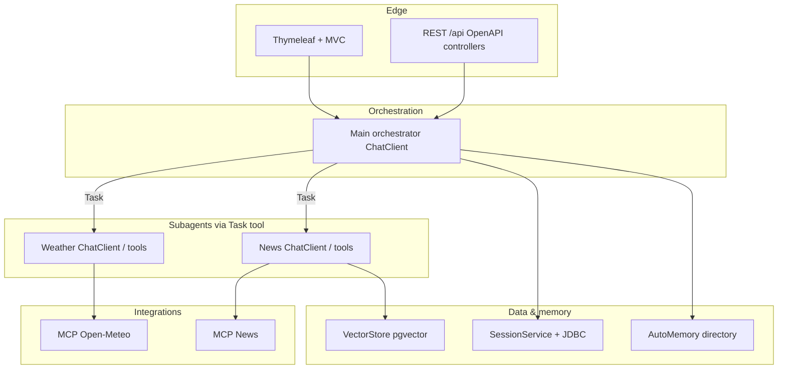
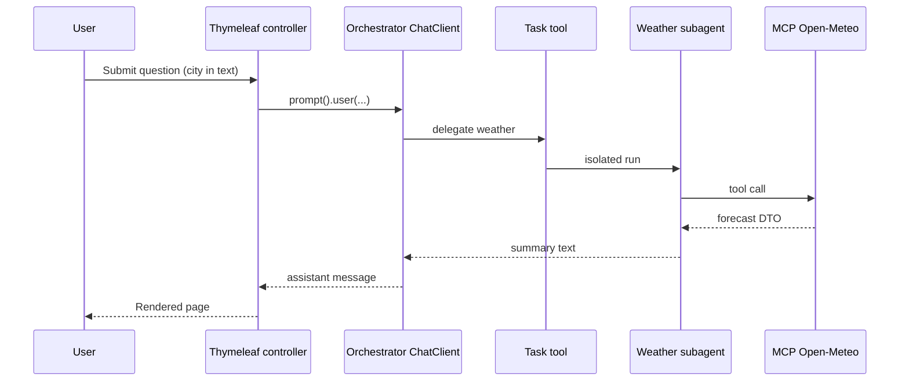
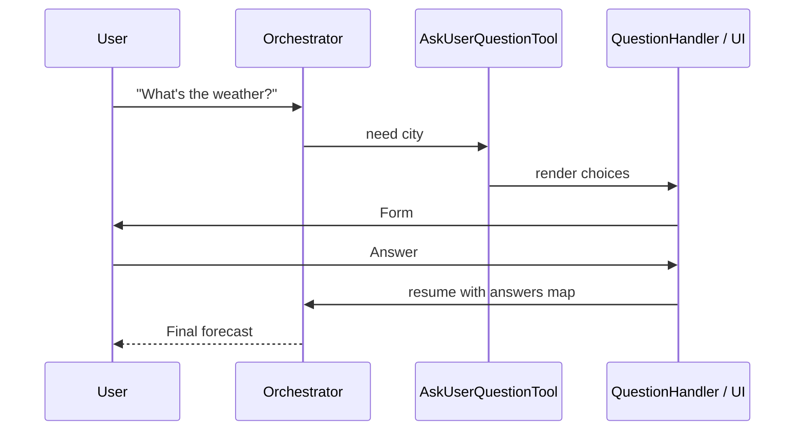

# Meteoris Insight — Architecture

Consolidated **architecture description** for **Meteoris Insight**. **Normative product requirements** (FR/NFR) are in [PRD.md](PRD.md). Assignment goals and Spring AI pattern narrative remain in [Project Vision](VISION.md); this document structures them for engineering review, onboarding, and implementation. Operational scenario examples live in [WORK-SCENARIOS.md](WORK-SCENARIOS.md).

**Related artifacts**

| Artifact | Role |
|----------|------|
| [PRD.md](PRD.md) | FR/NFR, API capability expectations, milestones, deliverables |
| [VISION.md](VISION.md) | Assignment scope, Parts 1–7 mapping, Modulith names (incl. **`app-core`** / `IdGenerator`), JDBC + id rules, eval metrics, implementation plan |
| [WORK-SCENARIOS.md](WORK-SCENARIOS.md) | User, API, agent, memory, eval, and CI scenario catalogue |
| [ai-context-strategy.md](ai-context-strategy.md) | How AI coding agents use `AGENTS.md` and `.agents/skills/` |

Repository root `AGENTS.md` holds **project-wide rules** (language, boundaries, commands).

---

## Table of contents

1. [System context](#1-system-context)
2. [Goals and constraints](#2-goals-and-constraints)
3. [Technology stack](#3-technology-stack)
4. [Build and deployment units](#4-build-and-deployment-units)
5. [Logical architecture](#5-logical-architecture)
6. [Spring Modulith module design](#6-spring-modulith-module-design)
7. [Agent runtime: ChatClient pipeline](#7-agent-runtime-chatclient-pipeline)
8. [Runtime flows](#8-runtime-flows)
9. [Data architecture](#9-data-architecture)
10. [Integrations](#10-integrations)
11. [API and presentation layers](#11-api-and-presentation-layers)
12. [Cross-cutting concerns](#12-cross-cutting-concerns)
13. [Quality attributes](#13-quality-attributes)
14. [Testing architecture](#14-testing-architecture)
15. [Extension points and non-goals](#15-extension-points-and-non-goals)
16. [Documentation map](#16-documentation-map)

Subsections under **section 9 (Data architecture):** identifiers and JDBC (**9.1**), PostgreSQL (**9.2**), AutoMemory filesystem (**9.3**), Flyway (**9.4**).

---

## 1. System context

Meteoris Insight is a **single deployable Spring Boot application** (`meteoris-insight`) plus a **separate Maven module** for black-box tests (`meteoris-insight-e2e`). End users interact through a **Thymeleaf** browser UI and/or **REST** clients generated from the same **OpenAPI** contract. The orchestrator delegates to **weather** and **news** capabilities backed by **MCP** servers (Open‑Meteo and a **keyless** news MCP). Short-term dialogue state uses the **Session API**; durable preferences use **AutoMemory** files; optional **pgvector** stores news embeddings for retrieval-style news assistance.



---

## 2. Goals and constraints

| Type | Content |
|------|---------|
| **Product** | Answer **weather** and **news** questions via an **orchestrator** + **subagents**, MCP-backed tools, **Session + AutoMemory + pgvector**, and a demonstrated **evaluation** module with at least one metric on a small dataset ([VISION.md](VISION.md)). |
| **LLM wiring** | **OpenAI-compatible HTTP** via programmatic Spring AI beans; stub mocks for CI ([PRD.md](PRD.md) **NFR-8**). |
| **Modularity** | **Spring Modulith**: strict **package boundaries** (`package-info.java`, `allowedDependencies`). Cross-module use of **`*.api`** types preferred over reaching into internal packages. |
| **Maven** | **Reactor** root `pom.xml` → `meteoris-insight` + `meteoris-insight-e2e`. |
| **UI** | **Thymeleaf** server-rendered pages for demo and manual testing; no SPA requirement. |
| **API** | **API-first**: canonical **`api/openapi.yaml`** for `/api/**`; generated server interfaces; E2E client from the **same** spec. |
| **Persistence** | **PostgreSQL 16** with **pgvector**; **Spring JDBC only** (`NamedParameterJdbcTemplate`, named params) + **Flyway** — **no JPA** (**NFR-3**). |
| **Identifiers** | **MongoDB-compatible** 24-char **lowercase** hex ids, **BSON ObjectId** byte layout; **`IdGenerator`** with **`extractCreationInstant`**. |
| **News** | **No API key** (Google News RSS, keyless). |
| **Tests** | **No live LLM** in default automated tests; **stub** chat/embedding beans under **`stub-ai`** / `test` / `e2e` profiles. |
| **Documentation** | **English only** for repo docs and code comments (root `AGENTS.md`). |

---

## 3. Technology stack

| Concern | Technology | Notes |
|---------|------------|--------|
| Language | **Java 21** | |
| Runtime | **Spring Boot 4.x** | Exact BOM TBD at scaffold time |
| Modularity | **Spring Modulith** | Logical modules `app-*` inside one JAR |
| Generative AI | **Spring AI** 2.x (**M4+** per vision) + **spring-ai-agent-utils** | SkillsTool, AskUserQuestionTool, TodoWriteTool, Task tool |
| LLM integration | **`spring-ai-starter-model-openai`**, explicit `OpenAiApi` / `OpenAiChatModel` beans | **`spring.ai.custom.chat.*`**, `spring.ai.openai.enabled: false`, `@Primary` `ChatModel` + `ChatClient`; see [PRD.md](PRD.md) **NFR-8**. |
| Embeddings (optional) | **`OpenAiEmbeddingModel`** from **`spring.ai.custom.embedding.*`** | Only if pgvector / semantic news is implemented; same property pattern as chat. |
| Session memory | **spring-ai-session** (community) + **JDBC starter** | `AI_SESSION`, `AI_SESSION_EVENT`; compaction advisors |
| Web MVC | **Spring Web MVC** + **Thymeleaf** | Forms for AskUser; chat pages |
| MCP | Java MCP client (e.g. community / Tools4AI stack — **finalize at implementation**) | Stdio or HTTP per server |
| Optional A2A | **spring-ai-a2a** server autoconfigure | AgentCard, JSON-RPC; **bonus** demo |
| Database | **PostgreSQL 16**, **pgvector** extension | Session + app tables + `news_articles`-style vectors |
| Data access | **Spring JDBC** (`NamedParameterJdbcTemplate`) | **No** JPA/Hibernate (**NFR-3**) |
| Primary keys | **`varchar(24)`** string ids | Generated by **`app-core`** `IdGenerator` (ObjectId layout; decode time via `extractCreationInstant`) |
| Migrations | **Flyway** | Recommended for reproducible schema |
| Build | **Maven** | `mvn verify` from project root |
| Docs site | **MkDocs** + **Material** | This file is part of the published docs |

---

## 4. Build and deployment units

| Unit | Packaging | Responsibility |
|------|-----------|------------------|
| Root `pom.xml` | `pom` (reactor only) | Orders modules; shared plugin management |
| `meteoris-insight` | `jar` (executable Spring Boot) | All Modulith packages, `api/openapi.yaml`, `templates/**`, Flyway scripts |
| `meteoris-insight-e2e` | `jar` (tests) | Black-box tests; OpenAPI-generated client; optional Playwright/Cucumber |

**Deployment artifact:** one fat JAR (or container image built from it) per environment. **E2E** is not deployed — it runs in CI or locally against a running instance.



---

## 5. Logical architecture

Single **modular monolith** process. Conceptual layers (see also the **Application Architecture** section in [VISION.md](VISION.md)):



**Dependency direction (goal):** Thymeleaf and REST **facades** depend on **application services** / orchestration facade, not the reverse. **Orchestrator** configuration lives in `app-agent-core`; it must not depend on Thymeleaf view names. **MCP adapters** sit in weather/news modules; orchestrator sees only **Spring `@Tool`** contracts.

---

## 6. Spring Modulith module design

Packages are grouped under a root such as `com.berdachuk.meteoris.insight` (exact groupId to be fixed at scaffold). Each row is a **Modulith module** (not a separate Maven module unless explicitly split later).

### 6.1 Module catalogue

| Module | Responsibility | Public surface | Typical dependencies |
|--------|----------------|----------------|----------------------|
| **`app-core`** (OPEN) | **`IdGenerator`**: ObjectId-layout `generateId()`, `isValidId`, **`extractCreationInstant`**; tiny shared helpers | Small util API | None (or JDK only) |
| **`app-api`** | HTTP + HTML edge: Thymeleaf controllers, REST controllers implementing **generated** OpenAPI interfaces, DTO mapping, session id propagation into orchestration calls | REST DTOs as per OpenAPI; MVC models for views | → `app-agent-core` (orchestration facade), optionally → `app-eval` for admin endpoints |
| **`app-agent-core`** | Orchestrator `ChatClient` **beans**, system prompts, **TaskToolCallbackProvider**, registration of SkillsTool / AskUser / Todo / advisors | Small `*.api` facade types if other modules must trigger chat | → `app-core`; → `app-weather-agent.api`, `app-news-agent.api`, `app-memory.api` (conceptually) |
| **`app-weather-agent`** | `weather-skill` assets; **WeatherMcpTool**; optional dedicated `ChatClient` for subagent | `WeatherResult`-style API types | MCP client libs; → `app-core` for ids if persisting rows |
| **`app-news-agent`** | `news-skill`; **NewsMcpTool**; vector ingest/search for news cache | `NewsItem` / search API types | MCP + JDBC/pgvector; → `app-core` |
| **`app-memory`** | **SessionService** wiring, Flyway for session tables if not auto; **AutoMemory** root configuration | `MemorySessionSupport` facade (example) | Spring JDBC, session starter; → `app-core` |
| **`app-eval`** | YAML/JSON eval sets, **EvaluationRunner**, metric reporters, optional REST to trigger runs | Eval report DTOs | → orchestration facade (or HTTP self-call in test mode); → `app-core` |

### 6.2 Allowed dependency philosophy

- **`app-core`** is **OPEN**: every module may depend on it for **`IdGenerator`** only; keep it free of Spring AI / MCP imports.
- **`app-api`** may call **application services** only; avoid JDBC and MCP imports in controllers.
- **`app-agent-core`** orchestrates; it **must not** depend on Thymeleaf.
- **`app-weather-agent`** / **`app-news-agent`** encapsulate MCP; **no** direct imports from one to the other’s `internal` packages.
- **`app-eval`** may invoke the orchestrator through a **narrow port** (interface) to keep Modulith tests green.

Modulith **`@ApplicationModule`**, **`allowedDependencies`**, and **`@NamedInterface`** should be added when the Java tree is created; illegal dependencies should fail **`mvn test`** via `spring-modulith-docs` / **`Modulith`**.

### 6.3 Physical layout (illustrative)

```text
meteoris-insight/src/main/java/.../
├── core/                # app-core — IdGenerator, tiny utils
├── api/                 # app-api
├── agent/               # app-agent-core
├── weather/             # app-weather-agent
├── news/                # app-news-agent
├── memory/              # app-memory
├── eval/                # app-eval
└── MeteorisInsightApplication.java

meteoris-insight/api/openapi.yaml
meteoris-insight/src/main/resources/templates/
meteoris-insight/src/main/resources/db/migration/
```

Exact package names will match the chosen `groupId` / product naming.

---

## 7. Agent runtime: ChatClient pipeline

### 7.1 Orchestrator stack (conceptual order)

Advisors and tools attach to the **orchestrator** `ChatClient` builder. Typical ordering (validate against Spring AI / community samples when coding):

1. **SessionMemoryAdvisor** — load/append session events; run compaction when triggers fire.
2. **AutoMemoryToolsAdvisor** (or equivalent) — inject long-term memory tools + system prompt fragment.
3. **ToolCallAdvisor** — ensure tool calls and results are visible in the message pipeline (required for reliable **TodoWriteTool** behaviour per Spring blog Part 3).

**Tools on orchestrator:**

| Tool | Role |
|------|------|
| **SkillsTool** | Progressive disclosure of `weather-skill` / `news-skill` |
| **AskUserQuestionTool** | Clarify city, topic, horizon |
| **TodoWriteTool** | Multi-step plan visibility |
| **Task tool** | Delegate to Weather / News subagents |
| **SessionEventTools** (optional) | `conversation_search` over archived turns |
| **Spring `@Tool`** beans | Thin facades over MCP (`getWeatherForecast`, `findNews`) **if** not exclusively inside subagents |

**Subagent `ChatClient` instances** (if used) carry **only** the tools needed for that role (MCP tools + optional vector search for news), **not** the Task tool.

### 7.2 Session branches

| Branch label | Visibility |
|--------------|------------|
| `null` / root | Shared compaction summaries and user turns at orchestrator level |
| `orch.weather` | Weather subagent tool traces |
| `orch.news` | News subagent tool traces |

**SessionMemoryAdvisor** instances for subagents should use **`EventFilter.forBranch`** so siblings do not leak each other’s tool chatter into the wrong context window.

### 7.3 AutoMemory vs Session

| Concern | Session | AutoMemory |
|---------|---------|------------|
| Lifetime | Per **session id**, bounded by compaction | Cross-session **Markdown files** |
| Content | Full dialogue + tool events (compacted) | Curated **facts** (`user`, `feedback`, …) |
| Storage | JDBC rows | Filesystem under configured root |

---

## 8. Runtime flows

### 8.1 Weather-only query (happy path)



### 8.2 Ambiguous weather (AskUserQuestionTool)



### 8.3 Mixed weather + news with TodoWriteTool

1. User sends compound prompt.
2. Orchestrator creates todos (e.g. weather A, weather B, news digest, synthesis).
3. **Single** `in_progress` at a time; Task delegations update todos.
4. Final assistant message merges results.

### 8.4 Evaluation batch (`app-eval`)

1. Load dataset resource from classpath.
2. For each case: create **fresh Session**; disable AutoMemory side effects if configured.
3. Send question through the **same** orchestration path as production (or stub LLM with fixed tool traces for deterministic tests — policy choice).
4. Run heuristics (regex / field checks); append to report JSON.

---

## 9. Data architecture

### 9.1 Identifiers and JDBC access

- **String ids:** all application-owned primary keys use **24 lowercase hex characters** encoding **12 bytes** in **MongoDB ObjectId** order: **timestamp (4 BE)** + **random (5)** + **counter (3)**. **`IdGenerator`** in **`app-core`** must implement **`extractCreationInstant(String id)`** to decode UTC creation time from the first four bytes (**NFR-2**).
- **Repositories:** implement persistence with **`NamedParameterJdbcTemplate`** and **named** SQL parameters only; keep SQL in text blocks or `.sql` resources; avoid string-concatenated dynamic SQL for values.
- **Forbidden:** **JPA**, **Hibernate**, **Spring Data JPA** repositories for Meteoris-owned tables.
- **OpenAPI:** resource id fields should declare **`pattern: '^[0-9a-f]{24}$'`** (and `minLength`/`maxLength` **24**) where ids are exposed on the wire.

### 9.2 PostgreSQL schemas (conceptual)

| Area | Tables / objects | Owner module |
|------|------------------|--------------|
| **Session API** | `AI_SESSION`, `AI_SESSION_EVENT` (append-only) | `app-memory` + Flyway or starter auto-DDL |
| **News vectors** | e.g. `news_articles(id varchar(24) PK, text, embedding vector(N), …)` | `app-news-agent` |
| **Optional app** | Users, audit — only if product requires | TBD |

**Vector dimension `N`** must match the embedding model dimension configured in Spring AI.

### 9.3 AutoMemory filesystem layout

| Path | Purpose |
|------|---------|
| `{root}/MEMORY.md` | Index of memory files |
| `{root}/*.md` | Typed memory documents |

Backup and access control of this directory are **deployment concerns** (mounted volume in containers).

### 9.4 Flyway strategy

- **Versioned** migrations for application tables and (if not auto-generated) Session tables.
- **Never** edit applied migration files in place — add a new version.

---

## 10. Integrations

### 10.1 MCP

| Server | Responsibility | Failure handling |
|--------|----------------|------------------|
| **Open‑Meteo** | Forecasts by lat/lon or city resolution | Map to structured application errors; user-friendly message |
| **News (keyless)** | **Google News RSS** — no API key required. Headlines / snippets from RSS feed. | Rate limits, empty results |

**Transport** (stdio vs HTTP) is an implementation detail of each MCP server; Java **MCP client** beans live in weather/news modules.

### 10.2 LLM providers

- Configure via Spring Boot properties and profiles (`local`, `test`, `e2e`).
- **Secrets** only via environment or external secret stores — never committed.

### 10.3 Optional A2A

- Expose **`/.well-known/agent-card.json`** describing orchestrator capabilities.
- **JSON-RPC** entrypoint per Spring AI A2A documentation.
- Keep A2A surface **aligned** with the same orchestration code path as Thymeleaf/REST to avoid logic drift.

---

## 11. API and presentation layers

### 11.1 OpenAPI-first REST

| Step | Action |
|------|--------|
| 1 | Edit `meteoris-insight/api/openapi.yaml` |
| 2 | Regenerate server interfaces (`openapi-generator-maven-plugin` or equivalent) |
| 3 | Implement interfaces in `app-api` REST package |
| 4 | Regenerate E2E client in `meteoris-insight-e2e` |

**Error model:** Prefer **RFC 7807** `application/problem+json` for validation and business errors if declared in the spec.

### 11.2 Thymeleaf presentation

- **Controllers** build model attributes (session id, last messages, pending AskUser payload).
- **Templates** stay thin: loops and fragments for question options; **CSRF** enabled for state-changing posts.
- **Internationalisation** of **user-visible** UI strings may use message bundles later; **developer documentation** remains English per project rules.

### 11.3 Correlation and session id

- HTTP **session** or signed cookie / header carries **Meteoris Session API** id into `SessionMemoryAdvisor` context (`SESSION_ID_CONTEXT_KEY`).
- Document the chosen mechanism in OpenAPI (for API clients) and in Thymeleaf controller JavaDoc.

---

## 12. Cross-cutting concerns

| Concern | Approach |
|---------|----------|
| **Security** | No secrets in git; validate all REST inputs against OpenAPI; sanitize Thymeleaf output (`th:text` vs `utext` policy per field); MCP script execution disabled unless explicitly required |
| **Observability** | Spring Boot Actuator; structured logs with **session id** and **trace id**; optional Micrometer metrics on tool latency |
| **Configuration** | Profile-specific `application-*.yml`; MCP endpoints and memory paths externalised |
| **CORS** | Restrict if browser SPA added later; default same-origin for Thymeleaf |
| **Resilience** | Timeouts on MCP and LLM HTTP clients; circuit breaker optional second phase |

---

## 13. Quality attributes

| Attribute | Tactic |
|-----------|--------|
| **Correctness** | Evaluation module + E2E + unit tests around tool DTO mapping |
| **Maintainability** | Modulith boundaries; API-first contract; skills in Markdown |
| **Observability** | Logging tool invocation outcomes (redact PII) |
| **Testability** | Stub AI profiles; Docker Compose Postgres for local + CI |
| **Portability** | Spring AI provider abstraction; MCP as sidecar processes |

---

## 14. Testing architecture

| Layer | Location | Focus |
|-------|----------|--------|
| **Unit** | `meteoris-insight/src/test/java` | Pure logic, DTO mappers, prompt builders |
| **Integration** | same + Testcontainers | JDBC, Session repository, pgvector queries |
| **E2E** | `meteoris-insight-e2e` | Full stack, OpenAPI client, stub LLM profile |
| **Docs** | `mkdocs build -s` | Broken links, nav |

**Gate:** `mvn verify` on parent should pass before merge; live LLM calls forbidden in default CI.

---

## 15. Extension points and non-goals

**Extension points**

- Additional **skills** under `.agents/skills`-style directory scanned by `SkillsTool`.
- Extra **subagents** (e.g. “summariser only”) registered in Task tool with new markdown agent defs.
- **SSE** streaming for chat in OpenAPI + Thymeleaf HTMX (future).

**Non-goals (v1)**

- Multi-tenant SaaS isolation.
- Mobile native clients.
- Replacing MCP with direct vendor SDKs inside orchestrator (keep MCP boundary unless explicitly changed in vision).

---

## 16. Documentation map

| Document | Audience |
|----------|----------|
| [VISION.md](VISION.md) | Product + assignment alignment (incl. **ObjectId-style ids**, **JDBC-only**) |
| **This file** | Engineers — structure, data, flows, modules |
| [WORK-SCENARIOS.md](WORK-SCENARIOS.md) | QA / PM / dev — scenario checklist |
| [USE-CASES.md](USE-CASES.md) | PM / dev — all use case IDs in one catalogue |
| [USER-STORIES.md](USER-STORIES.md) | PM / dev — `US-xx` backlog with acceptance criteria |
| [FORMS-AND-FLOWS.md](FORMS-AND-FLOWS.md) | PM / UX / dev — Thymeleaf routes, forms, UI/REST workflows |
| [WIREFRAMES.md](WIREFRAMES.md) | PM / UX — text wireframes for each screen |
| [EVALUATION-METHODOLOGY.md](EVALUATION-METHODOLOGY.md) | PM / dev — reproducible eval methodology and report schema |
| [IMPLEMENTATION-PLAN-WBS.md](IMPLEMENTATION-PLAN-WBS.md) | PM / dev — phased WBS aligned to PRD milestones |
| [ai-context-strategy.md](ai-context-strategy.md) | AI agent maintainers |

When architecture **changes** (new module, new table, new integration), update **this document** and, if user-visible or assignment-related, [VISION.md](VISION.md) in the same change set.
