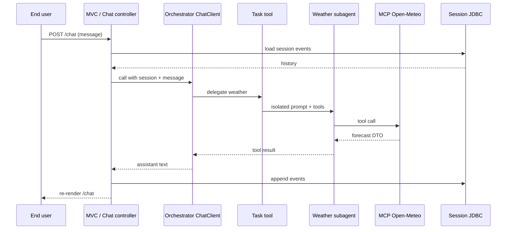
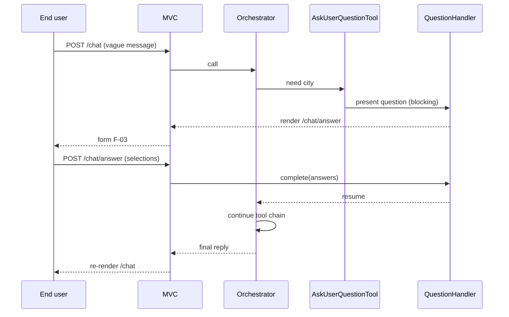
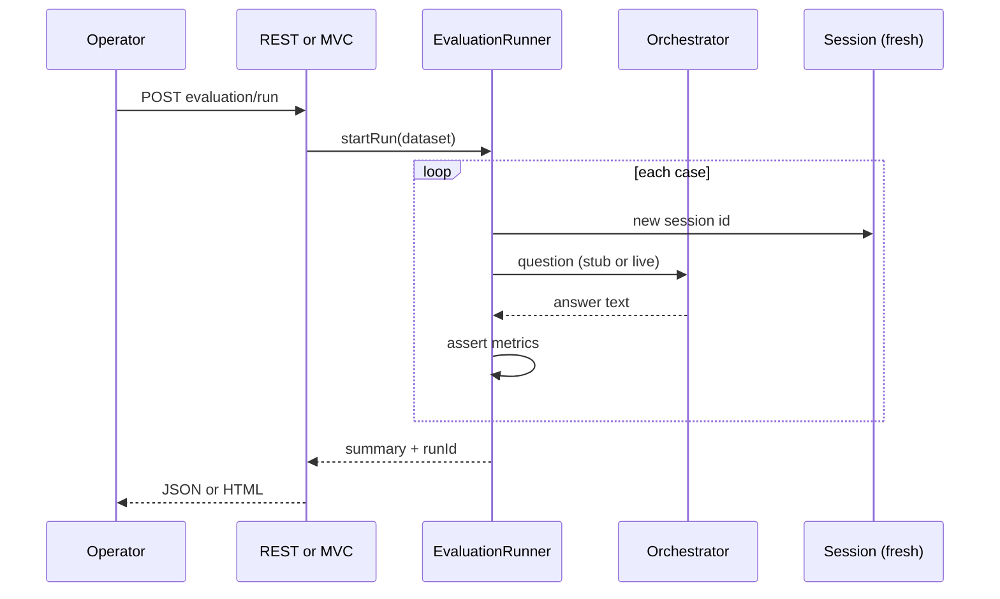
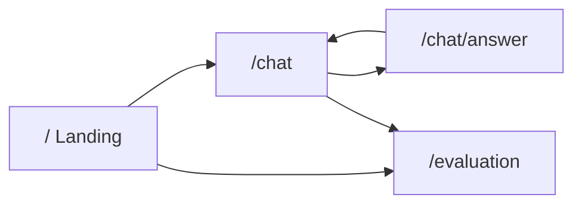

# Meteoris Insight — Forms and workflows

Specification of **Thymeleaf forms**, **page navigation**, and **end-to-end workflows** (UI + REST + agent/tool steps). Aligned with [PRD.md](PRD.md) (**FR-5**, **FR-8**, **FR-9**, **FR-10**), [USE-CASES.md](USE-CASES.md), and [USER-STORIES.md](USER-STORIES.md).

For **screen-level layout, labels, and empty/error states**, keep this document aligned with the text wireframes in [WIREFRAMES.md](WIREFRAMES.md).

For module boundaries and runtime architecture, see [ARCHITECTURE.md](ARCHITECTURE.md). **Canonical REST paths and schemas** must match `meteoris-insight/api/openapi.yaml` when present; this document uses **illustrative** routes where the contract is not yet fixed.

**Global UI rules ([PRD](PRD.md) NFR-6, vision):**

- Primary interaction uses **HTTP POST** and **server re-render** (Thymeleaf), not a SPA build.
- **Lightweight JavaScript** is optional (for example todo progress polling, copy-to-clipboard); core flows work without a client framework.
- Every **interactive** page shows the **demo disclaimer** (outputs are not professional weather, news, financial, or legal advice).
- Show **model id** (or stub profile name) where feasible for transparency.

---

## 1. Page map and form inventory

| Path | Primary purpose | Form? | Method | Notes |
|------|-----------------|-------|--------|--------|
| `/` | Landing / home | Optional | GET / POST | **GET** for links; **POST** optional for rare shortcuts (e.g. “seed demo session”) if ever added. |
| `/chat` | Orchestrated weather + news chat | **Yes** | POST | Main user message; session id via cookie or hidden field. |
| `/chat/answer` | **AskUser** continuation | **Yes** | POST | Renders structured choices or text inputs produced by **AskUserQuestionTool**; submits answers back into the same `ChatClient` flow via **QuestionHandler**. |
| `/evaluation` | Run eval + summary | **Yes** | POST | Dataset name / profile; mirrors REST eval trigger (**FR-10**). |

**Alternative routing:** Implementations may use `/` for chat or nest under `/app/chat`; keep **one** documented page map in README when paths differ.

---

## 2. Form specifications (Thymeleaf)

### F-01 — Landing (optional actions)

**Page:** `/`  
**Use cases:** U.01  

| Field | Type | Required | Description |
|-------|------|----------|-------------|
| — | — | — | Usually **no form**; navigation links only. |
| `action` | hidden | No | Reserved if dashboard adds POST shortcuts later. |
| CSRF | token | Yes | If Spring Security CSRF is enabled. |

**Outcome:** User navigates to `/chat` or other areas.

---

### F-02 — Chat message

**Page:** `/chat`  
**Use cases:** U.02–U.08, U.11, U.13  

| Field | Name (suggested) | Type | Required | Default | Validation |
|-------|------------------|------|----------|---------|------------|
| User message | `message` | textarea | Yes | — | Non-blank after trim; max length per **NFR-7** / server config |
| Session id | `sessionId` | hidden | No | from cookie | If absent, server creates session and sets cookie |
| CSRF | token | Yes | — | — | If CSRF enabled |

**Submit:** `POST /chat` (or `POST /chat/message`).

**Success:** Same page re-render with `reply` (assistant markdown or plain text), optional `todoState` fragment, optional `modelName`.

**AskUser branch:** If the orchestrator blocks on **AskUserQuestionTool**, the controller redirects or re-renders to **`/chat/answer`** (F-03) with a **question ticket** id in session or as a hidden field—exact wiring is implementation-specific but must preserve **QuestionHandler** continuity per Spring AI Part 2.

**Failure:** MCP timeout, LLM outage → user-visible banner; no stack trace (**U.13**, **N.04**).

**Parallel REST:** [Section 3](#3-json-forms-rest-post-bodies) — `POST /api/...` chat operation.

---

### F-03 — AskUser structured answer

**Page:** `/chat/answer`  
**Use cases:** U.02, U.03, A.04  

The server passes a **question model** (options with labels, single vs multi-select, optional free text) produced by **AskUserQuestionTool**.

| Field | Type | Required | Description |
|-------|------|----------|-------------|
| `questionId` | hidden | Yes | Correlates server-side `CompletableFuture` or ticket with pending tool call |
| `sessionId` | hidden | Yes | Same session as F-02 |
| `selectedOptionIds` | checkbox group or radio | Per question | Multi- or single-select per tool payload |
| `freeText` | text | No | When the question allows free text |
| CSRF | token | Yes | If enabled |

**Submit:** `POST /chat/answer` → **QuestionHandler** completes → orchestration resumes → redirect to **`/chat`** with final assistant message or another AskUser round.

**REST parallel:** Async pattern in **A.04** — for example `202` + `Location` to poll, or second `POST` with `questionTicketId` and answers in JSON (see OpenAPI when defined).

---

### F-04 — New chat session

**Page:** fragment on `/chat` or dedicated control  
**Use cases:** U.14  

| Field | Type | Required | Description |
|-------|------|----------|-------------|
| `action` | hidden | Yes | value `NEW_SESSION` |
| CSRF | token | Yes | If enabled |

**Submit:** `POST /chat` with new-session action → server issues **new** `Session` id; **AutoMemory** may remain per product policy (**M.04**).

---

### F-05 — Run evaluation

**Page:** `/evaluation`  
**Use cases:** E.03, U.20 (via API parity)  

| Field | Name (suggested) | Type | Required | Default |
|-------|------------------|------|----------|---------|
| Dataset | `dataset` | text / select | Yes | e.g. `meteoris-eval-v1` |
| Profile | `profile` | select | No | `stub-ai` for CI |
| CSRF | token | Yes | If enabled |

**Submit:** `POST /evaluation/run` (web handler delegates to **`app-eval`**).

**Success:** Re-render with `runId`, pass counts, optional link to export JSON (**E.06**).

**Parallel REST:** `POST /api/.../evaluation/run` per [PRD.md](PRD.md) API section.

---

### F-06 — Todo progress (optional)

**Page:** `/chat` fragment  
**Use cases:** U.10  

If implemented, either:

- **Server-only:** each POST to `/chat` re-renders todo list from last known state; or  
- **Lightweight poll:** `GET /chat/todos?sessionId=` returns HTML fragment (documented rate limit).

No requirement for WebSockets in baseline.

---

## 3. JSON “forms” (REST POST bodies)

Machine-facing equivalents of F-02–F-05. Paths are **illustrative** until `openapi.yaml` is authoritative.

| Operation | Method + path (illustrative) | Body fields |
|-----------|------------------------------|-------------|
| Send chat message | `POST /api/v1/chat/messages` | `sessionId`, `message` |
| Resume AskUser | `POST /api/v1/chat/questions/{ticketId}/answers` | `answers[]` or map of option ids / free text |
| Run evaluation | `POST /api/v1/evaluation/run` | `dataset`, `profile` |
| Stream (optional) | `GET` or contract-specific | Only if OpenAPI defines SSE/WebSocket |

**Responses:** See [PRD.md](PRD.md) example shapes; errors use **Problem+JSON** or contract error schema (**A.06**).

---

## 4. End-to-end workflows (narrative)

### Flow A — First visit: landing to chat

1. User opens **`GET /`**.
2. Clicks “Chat” (or primary CTA) → **`GET /chat`** (empty transcript or welcome text).
3. Session cookie may be created on first **`POST /chat`** if not already present (**U.01**).

---

### Flow B — Explicit weather query (happy path)

1. User **`POST /chat`** with message containing clear city (“Weather in Brest now”).
2. **SessionMemoryAdvisor** loads prior events; orchestrator infers intent.
3. **Task** delegates to **weather** subagent → **Open‑Meteo** MCP tool → normalized tool result.
4. Assistant reply rendered with units per **weather-skill** (**U.04**, **O.02**).

**Blocks if:** MCP unreachable → **Flow L**.

---

### Flow C — Weather with AskUser clarification

1. User **`POST /chat`** with vague weather ask (“What’s the weather?”).
2. Model invokes **AskUserQuestionTool** → server stores pending question + **QuestionHandler** future.
3. **`GET` or redirect to** `/chat/answer` with question model.
4. User **F-03** submits city (or coordinates).
5. Handler completes → orchestrator continues → **Task** + weather MCP (**U.02**).

---

### Flow D — News with AskUser clarification

1. User asks for “latest news” without topic (**U.03**).
2. Same AskUser pattern as Flow C; fields may include topic, language, time window.
3. **News** subagent + keyless news MCP → digest per **news-skill** (**U.05**).

---

### Flow E — Mixed weather and news (Todo optional)

1. User single message: weather in city A + news on topic B (**U.06**).
2. **TodoWriteTool** may create steps; **Task** runs weather then news (or policy-defined order).
3. Page may show **F-06** todo updates between full page posts if implemented.
4. Final merged assistant message (**O.04**).

---

### Flow F — Follow-up in same session

1. User returns **`POST /chat`** with “same for tomorrow” (**U.08**).
2. Same **session id**; **Session** events supply city/topic without re-AskUser if still valid (**M.01**).

---

### Flow G — Preference via AutoMemory

1. User states “always Celsius” (**U.09**).
2. Model may invoke **AutoMemoryTools**; files updated under configured root (**M.04**, **M.06**).
3. Later sessions: advisor loads memory; replies default to Celsius without repeating ask.

---

### Flow H — New chat

1. User submits **F-04** or clicks “New chat”.
2. New **Session** id; transcript cleared; preferences may persist (**U.14**).

---

### Flow I — REST-only integrator

1. Client obtains or creates `sessionId` via first POST response header or body.
2. **`POST /api/.../messages`** in a loop; handles **202 + ticket** if AskUser async is used (**A.04**).
3. Same orchestration stack as UI (**A.02**).

---

### Flow J — Evaluation batch (operator)

1. Operator opens **`/evaluation`** or calls **`POST /api/.../evaluation/run`**.
2. For each case: **new Session**, **AutoMemory disabled** (**M.08**); send question to orchestrator; assert **required_fields** or **min_headlines** (**E.01**, **E.02**).
3. Persist or log **run** summary; optional export failures (**E.06**) (**Flow K** detail).

---

### Flow K — CI evaluation (no UI)

1. **`mvn verify`** or profile invokes eval runner with **stub** `ChatClient`.
2. Exit non-zero on regression threshold failure (**E.04**, **D.03**).

---

### Flow L — MCP or LLM failure

1. Tool call throws timeout or HTTP error from MCP (**N.01**, **N.04**).
2. Orchestrator maps to user-safe message; UI shows banner (**U.13**).
3. Logs retain correlation id; **no** secrets in log line (**N.07**).

---

### Flow M — Optional A2A client (bonus)

1. External agent reads **`GET /.well-known/agent-card.json`** (**AA.01**).
2. Sends JSON-RPC message per Spring AI A2A server docs (**AA.02**).
3. **DefaultAgentExecutor** routes to same orchestrator pipeline as REST/UI.

---

## 5. Sequence diagrams (Mermaid)

### Flow B — Chat with weather delegation (simplified)

### Flow C — AskUser interrupt (simplified)

### Flow J — Evaluation run (simplified)

---

## 6. Navigation graph (UI)

**AskUser** is a **temporary** screen between chat turns; user always returns to **`/chat`** for the next free-form message unless UX merges answer into same page with fragments.

---

## 7. Error and empty states (UI)

| Situation | Expected UX |
|-----------|---------------|
| Empty message on **F-02** | Field or flash validation error; no LLM call |
| MCP timeout / 5xx | Friendly message; optional “retry” copy (**U.13**, **N.01**) |
| Empty news result | Honest “no articles found” (**N.03**) |
| LLM provider down | Banner + **503** on REST (**N.04**) |
| Oversized paste | Truncation or rejection per policy (**N.05**) |
| Eval dataset missing | **F-05** validation error; link to README dataset path |
| Invalid `sessionId` | 400 or new session at policy choice (document in README) |

---

## 8. Cross-reference

| This doc | Related |
|----------|---------|
| F-02, F-03, Section 3 | [PRD.md](PRD.md) — FR-5, FR-8, FR-9; example JSON |
| Flows B–M | [USE-CASES.md](USE-CASES.md) — U.*, A.*, O.*, M.*, E.* |
| Acceptance | [USER-STORIES.md](USER-STORIES.md) — US-01–US-40 |
| Wireframe screens | [WIREFRAMES.md](WIREFRAMES.md) — sections 1–8 |
| Runtime modules | [ARCHITECTURE.md](ARCHITECTURE.md) — sections 7–11 |

---

**Document version:** 1.0. Update when `openapi.yaml` finalizes paths or Thymeleaf routes change.
