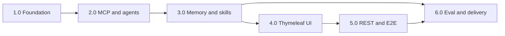

# Meteoris Insight — Implementation plan and WBS

**Work Breakdown Structure (WBS)** and step-by-step sequencing for **Meteoris Insight**. Normative scope: [PRD.md](PRD.md). Related: [ARCHITECTURE.md](ARCHITECTURE.md), [VISION.md](VISION.md), [EVALUATION-METHODOLOGY.md](EVALUATION-METHODOLOGY.md), [USER-STORIES.md](USER-STORIES.md), [USE-CASES.md](USE-CASES.md).

**Package root (planned):** under `com.berdachuk.*` per root `AGENTS.md` (exact base package TBD at scaffold; Modulith module ids remain **`app-core`**, **`app-api`**, …).

---

## 1. Objectives of this plan

| # | Objective |
|---|-----------|
| O1 | Decompose delivery into **work packages** with clear outputs and verification. |
| O2 | Align WBS phases with **PRD milestones M1–M6** and **user stories US-xx**. |
| O3 | Expose **dependencies** (technical order) and **parallel opportunities**. |
| O4 | Support **incremental demo**: boot → MCP → agents → memory → UI → API → eval → submission. |

---

## 2. WBS numbering convention

| Level | Pattern | Example |
|-------|---------|---------|
| Phase | `X.0` | `3.0` — Memory, skills, advisors |
| Work package | `X.Y` | `3.2` — Session JDBC + compaction |
| Task (optional) | `X.Y.Z` | `3.2.1` — Flyway `AI_SESSION` tables |

**Milestone mapping:** Phase **1.0** ≈ **M1**, **2.0** ≈ **M2**, **3.0** ≈ **M3**, **4.0** ≈ **M4**, **5.0** ≈ **M5**, **6.0** ≈ **M6** ([PRD.md](PRD.md) Milestones).

---

## 3. WBS outline (summary tree)

```
Meteoris Insight Implementation
├── 1.0 Foundation & platform (M1)
│   ├── 1.1 Maven reactor: pom.xml (root), meteoris-insight, meteoris-insight-e2e
│   ├── 1.2 Spring Boot BOMs: Boot, Modulith, Spring AI, Thymeleaf, JDBC, Flyway, Testcontainers (optional)
│   ├── 1.3 Modulith: package-info.java, allowedDependencies, *.api stubs, @ApplicationModuleTest
│   ├── 1.4 Flyway: Session tables + minimal app tables; pgvector extension; varchar(24) PKs
│   ├── 1.5 app-core: IdGenerator + unit tests (NFR-2)
│   ├── 1.6 LLM wiring: MeteorisInsightAiConfiguration + TestAIConfig (NFR-8)
│   ├── 1.7 api/openapi.yaml placeholder + openapi-generator + e2e client gen wiring
│   ├── 1.8 Docker Compose + application-local.example.yml + README skeleton
│   └── 1.9 Quality gate: mvn verify (unit + Modulith); stub profile only
├── 2.0 MCP & agent tools (M2)
│   ├── 2.1 Weather: MCP client adapter + WeatherMcpTool / @Tool bean
│   ├── 2.2 News: keyless MCP client + NewsMcpTool / @Tool bean
│   ├── 2.3 app-agent-core: orchestrator ChatClient skeleton + Task tool provider
│   ├── 2.4 Subagent ChatClient configs (weather, news) + registry markdown / beans
│   ├── 2.5 Wire tools into orchestrator; smoke: one weather + one news call (stub or local)
│   └── 2.6 [Optional] MCP transport integration tests with testcontainers or wiremock
├── 3.0 Memory, skills, advisors (M3)
│   ├── 3.1 SessionMemoryAdvisor + JDBC session repo + compaction policy
│   ├── 3.2 Branch labels (orch / orch.weather / orch.news) + filters
│   ├── 3.3 AutoMemoryTools root + AutoMemoryToolsAdvisor (or manual wiring)
│   ├── 3.4 SkillsTool + weather-skill + news-skill (SKILL.md + catalogue)
│   ├── 3.5 AskUserQuestionTool + QuestionHandler contract (in-memory completion for tests)
│   ├── 3.6 TodoWriteTool + ToolCallAdvisor as required
│   └── 3.7 [Optional] app-news-agent: pgvector table + embed/cache path per architecture
├── 4.0 Thymeleaf UI & AskUser (M4)
│   ├── 4.1 Layout, nav, demo disclaimer (WIREFRAMES + NFR-6)
│   ├── 4.2 GET / + GET /chat + POST /chat (F-02)
│   ├── 4.3 GET/POST /chat/answer for AskUser (F-03)
│   ├── 4.4 POST new-session action (F-04)
│   ├── 4.5 GET/POST /evaluation form (F-05) delegating to app-eval when ready
│   └── 4.6 [Optional] Todo fragment / polling (US-11)
├── 5.0 OpenAPI REST & E2E (M5)
│   ├── 5.1 Finalize openapi.yaml: chat, AskUser resume, evaluation run, errors
│   ├── 5.2 Implement generated API interfaces in app-api; delegate to services
│   ├── 5.3 meteoris-insight-e2e: generated client or REST Assured; health + chat contract tests
│   └── 5.4 CI: GitHub Actions `mvn verify` + OpenAPI validation (swagger-parser in tests)
├── 6.0 Evaluation, integration hardening, delivery (M6)
│   ├── 6.1 Versioned eval dataset YAML per EVALUATION-METHODOLOGY.md
│   ├── 6.2 EvaluationRunner: load cases, new session per case, stub profile, scoring
│   ├── 6.3 JSON report + failed-case export; REST + CLI triggers
│   ├── 6.4 Full-flow IT: Testcontainers PG (optional) + stub ChatClient + stub MCP boundary
│   ├── 6.5 README: run, LLM env, news MCP choice, eval procedure, demo script
│   └── 6.6 Screenshots / submission evidence; defect buffer
└── 7.0 [Stretch] Live-profile soak, A2A server, streaming API — only if time permits
```

---

## 4. Work package detail

### Phase 1.0 — Foundation and platform (Milestone 1)

| WBS | Work package | Primary module / location | Depends on | Deliverable / verification |
|-----|----------------|---------------------------|------------|----------------------------|
| 1.1 | Maven reactor POMs | `pom.xml` (root), `meteoris-insight/`, `meteoris-insight-e2e/` | — | `mvn -q validate` from project root |
| 1.2 | Spring Boot application class + dependencies | `meteoris-insight` | 1.1 | `mvn package -DskipTests` |
| 1.3 | Modulith package graph | `app-*` packages + `package-info.java` | 1.2 | `@ApplicationModuleTest` passes |
| 1.4 | Flyway V1+ migrations | `src/main/resources/db/migration` | 1.2 | Clean migrate on empty Postgres |
| 1.5 | `IdGenerator` | `app-core` | 1.4 | Unit tests: format, uniqueness, `extractCreationInstant` |
| 1.6 | LLM configuration beans | `app-core` or `app-agent-core` | 1.2 | **NFR-8**: `TestAIConfig` mocks `test`; real `@Profile("!test")` reads `spring.ai.custom.chat.*` |
| 1.7 | OpenAPI placeholder + codegen | `meteoris-insight/api/openapi.yaml`, Maven plugin | 1.2 | Generated sources compile |
| 1.8 | Docker Compose Postgres 16 + pgvector | repo root / `deploy/` | — | `docker compose up -d`; JDBC connects |
| 1.9 | README skeleton + profiles | `README.md` | 1.6–1.8 | Document `stub-ai`, `local`, ports |

**User stories:** Prerequisites for US-41–US-48, US-16.

---

### Phase 2.0 — MCP and agent tools (Milestone 2)

**Transport note (v1):** Weather and news tools use **Open‑Meteo public HTTP** and **Google News RSS** behind the same `@Tool` contracts as MCP-backed integrations; see [PRD.md](PRD.md) *v1 implementation note*.

| WBS | Work package | Primary module | Depends on | Deliverable / verification |
|-----|----------------|----------------|------------|----------------------------|
| 2.1 | Open‑Meteo MCP integration | `app-weather-agent` | 1.x, MCP runtime dep | Tool returns normalized DTO; unit test with stub transport |
| 2.2 | Keyless news MCP integration | `app-news-agent` | 1.x | Same; README names chosen MCP |
| 2.3 | Orchestrator `ChatClient` + **Task** tool | `app-agent-core` | 1.6, 2.1, 2.2 | Bean graph starts; no nested Task on subagents |
| 2.4 | Weather / news subagent definitions | `app-agent-core` + `app-weather-agent` / `app-news-agent` | 2.3 | Subagent prompts + allow-lists |
| 2.5 | End-to-end smoke (in-process) | `integration-test` or `src/test` | 2.4 | One weather + one news question → assistant text (stub LLM returning canned tool-use or fixed reply policy agreed for test) |

**User stories:** US-22–US-28, US-23–US-24, US-52 (partial).

---

### Phase 3.0 — Memory, skills, advisors (Milestone 3)

| WBS | Work package | Primary module | Depends on | Deliverable / verification |
|-----|----------------|----------------|------------|----------------------------|
| 3.1 | Session JDBC + advisor + compaction | `app-memory` + `app-agent-core` | 1.4, 2.3 | Session events persisted; compaction triggers in test |
| 3.2 | Branch isolation | `app-memory` / advisor config | 3.1 | Documented branch names |
| 3.3 | AutoMemory | `app-memory` | 2.3 | Filesystem root; advisor registered |
| 3.4 | **SkillsTool** + skills | `app-agent-core`, `app-weather-agent`, `app-news-agent` | 2.3 | Skills load on demand in manual test |
| 3.5 | **AskUserQuestionTool** + **QuestionHandler** | `app-agent-core`, `app-api` | 2.3 | Unit test: tool blocks until handler completes |
| 3.6 | **TodoWriteTool** + visibility hooks | `app-agent-core` | 2.3 | Multi-step prompt test (optional UI later) |
| 3.7 | Optional pgvector | `app-news-agent` | 1.4, 1.6 embedding if used | Schema + optional similarity query |

**User stories:** US-29–US-33, US-12, US-03–US-04, US-07, US-11.

---

### Phase 4.0 — Thymeleaf UI and AskUser (Milestone 4)

| WBS | Work package | Primary module | Depends on | Deliverable / verification |
|-----|----------------|----------------|------------|----------------------------|
| 4.1 | Global layout + nav + disclaimer | `app-api` templates | 1.2 | Matches [WIREFRAMES.md](WIREFRAMES.md) shell |
| 4.2 | Landing `/` | `app-api` | 4.1 | US-01 |
| 4.3 | Chat `/chat` POST message | `app-api` | 3.5, 4.1 | US-02–US-08 (manual); session cookie |
| 4.4 | AskUser `/chat/answer` | `app-api` | 4.3 | US-02, US-03 |
| 4.5 | New chat control | `app-api` | 4.3 | US-15 |
| 4.6 | Evaluation page shell | `app-api` | 4.1 | Form posts (runner may stub until 6.x) |

**User stories:** US-01–US-15, US-14.

---

### Phase 5.0 — OpenAPI REST and E2E (Milestone 5)

| WBS | Work package | Primary module | Depends on | Deliverable / verification |
|-----|----------------|----------------|------------|----------------------------|
| 5.1 | Complete `openapi.yaml` | `meteoris-insight/api/` | 4.x behaviour known | Paths for chat, eval, errors |
| 5.2 | REST controllers implement generated interfaces | `app-api` | 5.1 | Same delegation as Thymeleaf services |
| 5.3 | `meteoris-insight-e2e` tests | `meteoris-insight-e2e` | 5.2, runnable JAR | **Integration harness:** `@SpringBootTest` + Testcontainers + REST (health / chat / eval contract paths). True separate-JVM black-box against `-exec.jar` is optional stretch. |
| 5.4 | CI verify reactor | parent POM | 5.3 | `.github/workflows/maven-verify.yml`: `mvn clean verify` (Docker on runner for Testcontainers) |

**User stories:** US-16–US-21, US-43, US-45.

---

### Phase 6.0 — Evaluation, hardening, delivery (Milestone 6)

| WBS | Work package | Primary module | Depends on | Deliverable / verification |
|-----|----------------|----------------|------------|----------------------------|
| 6.1 | Eval dataset + schema validation | `app-eval` resources | [EVALUATION-METHODOLOGY.md](EVALUATION-METHODOLOGY.md) | YAML loads; version field present |
| 6.2 | `EvaluationRunner` + scoring | `app-eval` | 2.5 orchestration entry, 6.1 | Stub profile pass rate deterministic |
| 6.3 | REST + CLI + report JSON | `app-eval`, `app-api` | 6.2 | US-20, US-37–US-40 |
| 6.4 | Full-flow integration test | `meteoris-insight/src/test` | 1.8, 1.6 stubs | Optional Testcontainers; no live LLM |
| 6.5 | README completion | repo | all | PRD deliverables list |
| 6.6 | Demo assets | `docs/` or `docs/submission/` | 6.5 | Screenshots / logs per course |

**User stories:** US-34–US-40, US-20, US-44, US-38.

---

### Phase 7.0 — Stretch (post-M6 or if time permits)

| WBS | Work package | Notes |
|-----|----------------|-------|
| 7.1 | A2A server + AgentCard | PRD optional; feature flag |
| 7.2 | SSE / streaming chat in OpenAPI | Optional |
| 7.3 | SessionEventTools `conversation_search` | US-13 |
| 7.4 | Playwright UI E2E | Beyond minimal REST e2e |

---

## 5. Milestone ↔ WBS mapping

| PRD milestone | WBS phases (primary) | Exit criterion (summary) |
|---------------|----------------------|----------------------------|
| **M1** | 1.0 | App boots; Flyway ok; **IdGenerator** + **Modulith** + **stub LLM** + OpenAPI codegen wired |
| **M2** | 2.0 | Both MCP tool paths + orchestrator **Task** + subagents; smoke tests |
| **M3** | 3.0 | Session + compaction + AutoMemory + Skills + AskUser + Todo (+ optional pgvector) |
| **M4** | 4.0 | Thymeleaf **/**, **/chat**, **/chat/answer**, disclaimer |
| **M5** | 5.0 | REST matches **openapi.yaml**; **meteoris-insight-e2e** green |
| **M6** | 6.0 | Eval runner + report + README + **`mvn verify`** stub profile + evidence artifacts |
| *(stretch)* | **7.0** | A2A, streaming, advanced recall, UI Playwright |

---

## 6. Critical path (suggested)



**Notes:** **6.0** eval runner can start after **2.5** using in-process orchestration (parallel with 4.0–5.0) if staffing allows; UI (4.0) is not strictly blocking eval JSON in **6.2** but PRD expects integrated demo — sequence **4 → 5 → 6** is the safest demo path.

**Parallelism:** **1.8** Compose + **1.7** OpenAPI can proceed alongside **1.5**–**1.6**; **3.7** pgvector can slip to after **6.2** if schedule tight.

---

## 7. Definition of Done (release checklist)

- [x] `mvn verify` from **project root** green with **`stub-ai`** + **`test-pgvector`** (no live LLM). Requires **Docker** for **Testcontainers** PostgreSQL 16 + pgvector (`pgvector/pgvector:pg16`); see [`application/AGENTS.md`](https://github.com/berdachuk/ai-architect-6-agents/blob/main/application/AGENTS.md) (*Database and automated tests*). Local **`spring-boot:run`** defaults to **`stub-ai,docker-db`** — start Postgres with **`docker compose up -d`** before the app.
- [x] **`@ApplicationModuleTest`** (or equivalent slice) passes in addition to full-graph `ApplicationModules.verify()` — see `ModulithStructureTest` and `EvaluationModuleIntegrationTest`.
- [x] **OpenAPI** is source of truth for `/api/**`; spec includes **RFC 9457**-style **`ApiError`** on 4xx/5xx. **`meteoris-insight-e2e`** uses an **in-process Spring Boot harness** (same bytecode as production) + Testcontainers, not a separate JVM against the `-exec` JAR (see §5.3 table note).
- [x] **Weather** and **news** flows demonstrable via **Thymeleaf** and via **REST** (minimal paths).
- [x] **AskUser** path demonstrable via **REST** (stub ticket flow + invalid ticket **404** `application/problem+json`).
- [x] **Evaluation** run produces **JSON report** per [EVALUATION-METHODOLOGY.md](EVALUATION-METHODOLOGY.md); **≥1** metric on **≥10** cases in dataset `meteoris-eval-v1`.
- [x] **README:** clone → Compose → run → stub eval → optional `local` profile for live LLM; keyless news integration (**Google News RSS**) and **LLM** env vars (**NFR-8**) documented.
- [x] **Disclaimer** on interactive pages ([PRD.md](PRD.md) **NFR-6**).
- [x] **Screenshots** or logs: checklist and suggested filenames in [`docs/submission/README.md`](submission/README.md); root README links the folder.

---

## 8. User story coverage (rollup)

| Phase | US range (primary) |
|-------|---------------------|
| 1.0 | US-41–US-48, US-16 (prep), US-47–US-48 |
| 2.0 | US-22–US-30, US-23–US-24, US-52 |
| 3.0 | US-29–US-33, US-03–US-04, US-07, US-10–US-12 |
| 4.0 | US-01–US-15 |
| 5.0 | US-16–US-21, US-43–US-45 |
| 6.0 | US-20, US-34–US-40, US-44, US-38 |
| 7.0 | US-49–US-51, US-13, optional UI E2E |

---

## 9. Risks and mitigations

| Risk | Mitigation |
|------|------------|
| spring-ai-session BOM drift | Pin versions per Spring AI release notes; spike **1.4** early. |
| MCP flakiness in CI | Stub MCP at HTTP/stdio boundary in **test**; live MCP only in `local`. |
| OpenAPI / codegen churn | Lock plugin versions; **5.4** drift check in CI. |
| Scope creep (A2A, streaming) | Defer to **7.0**; keep M1–M6 green first. |
| Eval non-determinism with live LLM | Course evidence uses **stub** profile + fixed stub outputs per **EVALUATION-METHODOLOGY.md**. |

---

## 10. Document control

| Version | Date | Note |
|---------|------|------|
| 1.0 | 2026-04-18 | Initial WBS aligned to PRD M1–M6 and Meteoris architecture docs |
| 1.1 | 2026-04-18 | DoD refresh: Testcontainers verify, OpenAPI error model, §5.3 E2E harness clarification |

**Change process:** Update this file when milestones or module boundaries change; keep [PRD.md](PRD.md) authoritative for FR/NFR.
