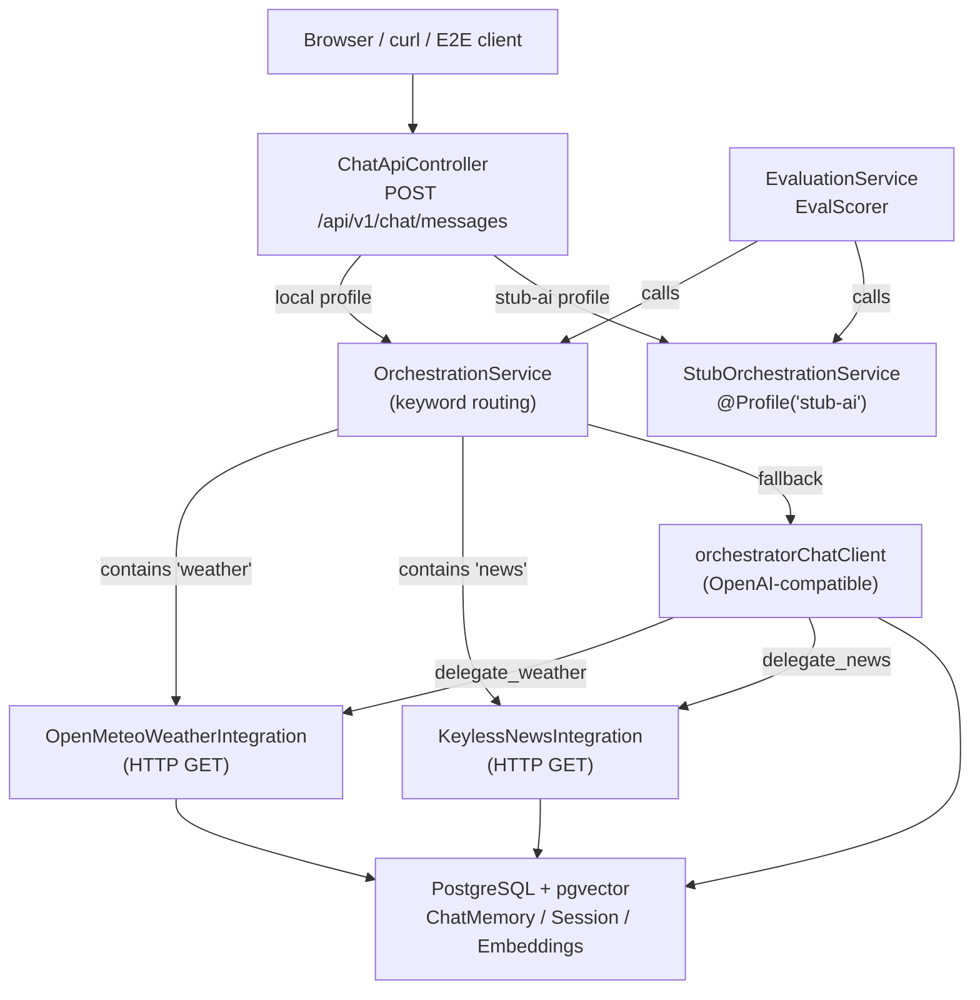
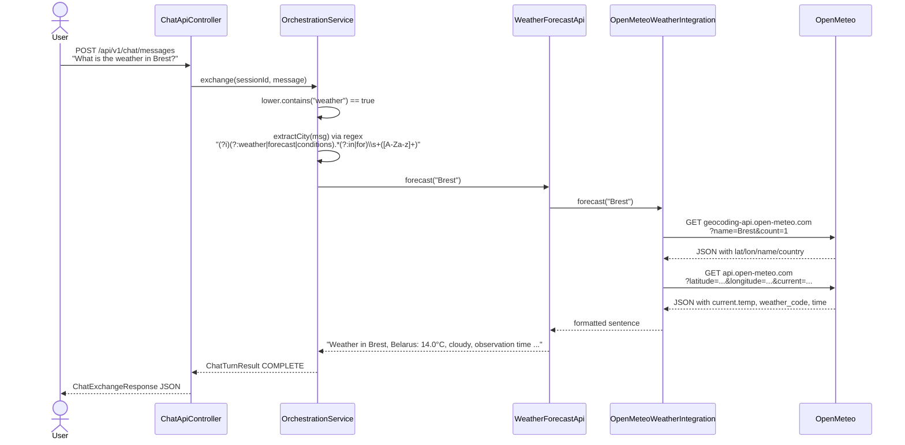
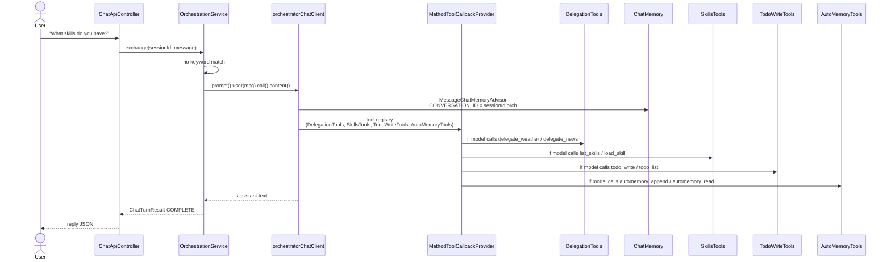
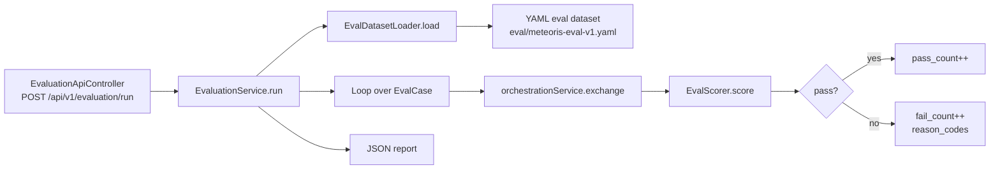

# Technical Overview — Meteoris Insight

This document describes the internal mechanics of Meteoris Insight: how a user request enters the system, how it is classified and routed, which agents and tools are invoked, and how the evaluation pipeline measures correctness. All references are grounded in the actual Java source tree under `meteoris-insight/src/main/java`.

## Architecture at a glance

Meteoris Insight is a Spring Boot 4.x application built with Spring Modulith boundaries. It exposes a Thymeleaf UI and an OpenAPI-first REST API, keeps chat state in PostgreSQL (with pgvector), and routes questions through either a deterministic keyword path or an LLM-backed orchestrator. External data arrives from two keyless sources: Open-Meteo (weather) and Google News RSS (news).



## Profiles and environments

| Profile | Active beans | LLM | Integrations | Purpose |
|---------|--------------|-----|--------------|---------|
| `local` (default `docker-db`) | `OrchestrationService`, `LiveAgentConfiguration`, `OpenMeteoWeatherIntegration`, `KeylessNewsIntegration` | Live OpenAI-compatible endpoint via `meteorisChatModel` | Live HTTP to Open-Meteo and Google News RSS | Developer / production-like local runs |
| `stub-ai` | `StubOrchestrationService`, `StubAiConfiguration`, `StubWeatherIntegration`, `StubNewsIntegration` | `stubChatModel` returning a static message | Deterministic stub implementations | CI, unit tests, `mvn verify`, environments with no GPU / no LLM |

The `spring.profiles.default` in `application.yml` is `docker-db`; the `stub-ai` profile is selected explicitly via `SPRING_PROFILES_ACTIVE=stub-ai` or Maven property (`-Dspring.profiles.active=stub-ai`).

## Request flow (REST entry to response)

1. **Client sends a message**: `POST /api/v1/chat/messages` via `ChatApiController.postChatMessage(ChatMessageRequest)`
2. **Session resolution**: The controller reads `sessionId` from the request body, or falls back to `SessionCookieSupport.readOrCreate(request, response, idGenerator)` which mints a new 24-char hex ObjectId if no cookie exists
3. **Session touched**: `SessionService.touch(sessionId)` updates `updated_at` in the `ai_session` table via `NamedParameterJdbcTemplate`
4. **Orchestration dispatch**: `ChatApiController` delegates to `ChatOrchestration.exchange(sessionId, rawMessage)`
5. **Profile-dependent routing**:
   - **Live profile**: `OrchestrationService.exchange(...)` is invoked
   - **Stub profile**: `StubOrchestrationService.exchange(...)` replaces it because it carries `@Profile("stub-ai")` and the same `@Service` stereotype; Spring’s `@ConditionalOnMissingBean` semantics are not used here — instead the profile annotation makes only the stub visible when `stub-ai` is active
6. **Keyword classification (both services)**:
   - `lower.contains("weather")` → direct weather path
   - `lower.contains("news")` → direct news path
   - Otherwise → fallback (live LLM for local, static help text for stub)
7. **Response packaging**: `ChatApiController.toApi(ChatTurnResult)` maps `ChatTurnResult` fields into the generated `ChatExchangeResponse` DTO (status, reply, modelName, ticketId, options) and returns it as JSON

### Weather keyword routing (direct path)



### News keyword routing (direct path)

```mermaid
sequenceDiagram
    actor User
    participant ChatApiController
    participant OrchestrationService
    participant NewsDigestApi
    participant KeylessNewsIntegration
    participant GoogleNews

    User->>ChatApiController: POST /api/v1/chat/messages<br/>"Latest news about climate"
    ChatApiController->>OrchestrationService: exchange(sessionId, message)
    OrchestrationService->>OrchestrationService: lower.contains("news") == true
    OrchestrationService->>OrchestrationService: extractTopic(msg)<br/>looks for "about ...", else defaults to "general"
    OrchestrationService->>NewsDigestApi: latestHeadlines("climate")
    NewsDigestApi->>KeylessNewsIntegration: latestHeadlines("climate")
    KeylessNewsIntegration->>GoogleNews: GET news.google.com/rss/search?q=climate
    GoogleNews-->>KeylessNewsIntegration: RSS XML
    KeylessNewsIntegration->>KeylessNewsIntegration: regex parse &lt;item&gt; / &lt;title&gt;
    KeylessNewsIntegration-->>NewsDigestApi: "News digest (climate, Google News RSS, keyless):\n1. ...\n2. ..."
    NewsDigestApi-->>OrchestrationService: digest string
    OrchestrationService-->>ChatApiController: ChatTurnResult COMPLETE
    ChatApiController-->>User: ChatExchangeResponse JSON
```

### Fallback LLM path (non-weather, non-news)

When the message contains neither keyword, `OrchestrationService` falls back to the live orchestrator:



The system prompt in `LiveAgentConfiguration.orchestratorChatClient` explicitly tells the model:
- For weather questions → call `delegate_weather`
- For news questions → call `delegate_news`
- You may use `list_skills`, `load_skill`, `todo_write`, `automemory_append`, `automemory_read`

## Dual routing strategy

Meteoris Insight employs **two independent routing layers**:

1. **Direct keyword routing** inside `OrchestrationService.exchange()` — fast, deterministic, no LLM latency. This is the default for the happy-path weather and news queries. It uses the same `extractCity()` and `extractTopic()` static helpers as the tool layer.
2. **@Tool-based delegation** inside `DelegationTools` — registered in `MethodToolCallbackProvider` and exposed to the LLM. These methods (`delegate_weather`, `delegate_news`) call the same `WeatherForecastApi.forecast()` and `NewsDigestApi.latestHeadlines()` interfaces, but the invocation is driven by the model’s tool-choice decision rather than by hard-coded keywords.

Why both? Direct keyword routing guarantees that simple weather/news queries resolve reliably even if the model makes a poor tool-choice decision or the LLM endpoint is slow. The `@Tool` layer exists for multi-turn conversations and complex prompts where the orchestrator may still decide to call a specialist after reasoning.

## Tool inventory

All tools are Spring beans collected into a single `MethodToolCallbackProvider` wired into the orchestrator `ChatClient`.

| Bean class | `@Tool` methods | Responsibility | Live vs stub |
|-----------|-----------------|----------------|--------------|
| `DelegationTools` | `delegate_weather(String)`, `delegate_news(String)` | Direct HTTP calls to weather/news integrations | Active in both; stub profile uses `StubWeatherIntegration` / `StubNewsIntegration` via interface injection |
| `SkillsTools` | `list_skills()`, `load_skill(String)` | Discover and return `.agents/skills/**/SKILL.md` content at runtime | Active in both |
| `TodoWriteTools` | `todo_write(String)`, `todo_list()` | Append / list per-session todo items in `TodoStateStore` (in-memory `ConcurrentHashMap`) | Active in both |
| `AutoMemoryTools` | `automemory_append(type, line)`, `automemory_read(type)`, `automemory_index()`, `appendPreference(line)`, `readPreferences()` | Append / read durable markdown entries in `~/.meteoris-insight/automemory/` | Active in both |
| `WeatherTools` | `getWeatherForecast(String)` | Alternative wrapper around `WeatherIntegration`; exposed but **not** wired into the orchestrator’s `MethodToolCallbackProvider` (specialist path removed to avoid nested LLM timeouts) | `LiveAgentConfiguration` creates the bean; not registered in `orchestratorToolCallbacks` |
| `NewsTools` | `findNews(String)` | Wrapper with optional pgvector cache fallback via `NewsEmbeddingWriteService` | Same as `WeatherTools` — bean exists but is **not** in the orchestrator tool provider |

`WeatherTools` and `NewsTools` remain in the codebase as standalone `@Tool` classes but are excluded from the orchestrator’s `MethodToolCallbackProvider` because the orchestrator now uses `delegate_weather` / `delegate_news` from `DelegationTools`, which call the integration layer directly without a secondary LLM round-trip.

## Weather integration — Open-Meteo

`OpenMeteoWeatherIntegration` (profile `!stub-ai`) performs two sequential HTTP requests:

1. **Geocoding**: `GET https://geocoding-api.open-meteo.com/v1/search?name={city}&count=1&language=en&format=json`
   - Parses `results[0].latitude`, `.longitude`, `.name`, `.country` with Jackson `ObjectMapper.readTree`
2. **Forecast**: `GET https://api.open-meteo.com/v1/forecast?latitude={lat}&longitude={lon}&current=temperature_2m,relative_humidity_2m,weather_code,wind_speed_10m&timezone=auto`
   - Parses `current.temperature_2m`, `weather_code`, `time`
3. **Mapping**: `describeWmo(int code)` maps WMO weather codes to human-readable strings (`clear sky`, `rain`, `snow`, etc.)
4. **Formatting**: returns a single sentence: `"Weather in {name}, {country}: {temp}°C, {conditions}, observation time {time} (Open-Meteo)."`

`StubWeatherIntegration` (profile `stub-ai`) returns a canned sentence with a fixed timestamp (`2026-04-18T12:00:00Z`) and ignores real weather data.

## News integration — Google News RSS

`KeylessNewsIntegration` (profile `!stub-ai`) fetches headlines without an API key:

1. **Request**: `GET https://news.google.com/rss/search?q={topic}&hl=en-US&gl=US&ceid=US:en`
2. **Parsing**: applies two regexes over the raw XML:
   - `ITEM = Pattern.compile("<item>[\\s\\S]*?</item>", CASE_INSENSITIVE)`
   - `TITLE = Pattern.compile("<title>\\s*<!\\[CDATA\\[([^\\]]+)\\]\\]>...</title>|<title>([^<]+)</title>", CASE_INSENSITIVE)`
3. **Deduplication**: stores up to 8 titles in a `LinkedHashSet` (preserves order, skips repeats)
4. **Formatting**: returns `"News digest ({topic}, Google News RSS, keyless):\n1. ...\n2. ..."`

`StubNewsIntegration` (profile `stub-ai`) returns three canned headlines.

### pgvector cache layer (NewsTools)

When `NewsTools.findNews(String)` is called directly (not via the current orchestrator path), it:
1. Embeds the topic via `EmbeddingModel.embed(topic)`
2. Queries `NewsArticleEmbeddingRepository.findNearestHeadlines(queryVector, 5)`
3. If at least 3 cached headlines exist for the topic, returns a cached digest annotated with vector distances
4. Otherwise calls the live integration and, if `NewsEmbeddingWriteService` is available, persists the new headlines with embeddings

This cache path is primarily exercised through direct `@Tool` invocation or in future specialist subagent flows.

## Conversation memory and branching

Chat memory is stored in PostgreSQL via Spring AI’s `JdbcChatMemoryRepository`. The key is a conversation id produced by `ConversationBranches`:
- `orchestrator(sessionId)` → `"{sessionId}:orch"`
- `weather(sessionId)` → `"{sessionId}:orch.weather"` (reserved)
- `news(sessionId)` → `"{sessionId}:orch.news"` (reserved)

`OrchestrationService` sets `CONVERSATION_ID` to the orchestrator branch before every fallback LLM call. The `MessageChatMemoryAdvisor` (configured in `LiveAgentConfiguration`) appends the last N messages to the prompt automatically.

Session metadata lives in the `ai_session` table (`id`, `conversation_id`, `created_at`, `updated_at`, `compacted_at`) and is managed by `SessionService` with `NamedParameterJdbcTemplate`.

## Evaluation pipeline

The evaluation module is a standalone service (`app-eval`) that calls the same `ChatOrchestration` facade the REST layer uses.



### Data format

The dataset `eval/meteoris-eval-v1.yaml` contains:
- `weather` cases: `expected_city`, `required_fields` (e.g., `["city","temperature","conditions","time"]`)
- `news` cases: `min_headlines`, `require_source_or_time`

### Scoring logic (`EvalScorer`)

`EvalScorer.score(EvalCase, answer, reasonCodes)` is a static, deterministic checker:

**Weather** (`type == "weather"`):
1. `expectedCity` must appear as a substring in the answer (case-insensitive)
2. Every field in `requiredFields` must be present:
   - `city` — any alphabetic characters exist
   - `temperature` — contains `°`, `c`, or `temp`
   - `conditions` — contains one of: `cloud`, `fair`, `rain`, `snow`, `clear`, `partly`, `drizzle`, `foggy`, `shower`, `storm`
   - `time` — contains `time`, `tz`, or a `YYYY-MM-DD` pattern
3. If any check fails, a reason code (`missing_city`, `missing_field:...`) is added and the case is marked **fail**

**News** (`type == "news"`):
1. Count headline lines matching `^\s*(?:\d+\.\s+|[-*]\s+).+$`
2. If the count is `< minHeadlines`, reason code `min_headlines:X<Y` → **fail**
3. If `requireSourceOrTime` is true and the answer lacks `http` or a date keyword (`today`, `yesterday`, `202[0-9]`) → reason code `missing_source_or_time` → **fail**

### Running evaluation

- **REST**: `POST /api/v1/evaluation/run` with `EvaluationRunRequest` (`dataset`, optional `profileOverride`)
- **CLI**: `EvalCliConfiguration` prints the JSON report to stdout when run with `--meteoris.eval.dataset=...`
- **CI**: `mvn verify` with `stub-ai` profile evaluates against deterministic stubs; no live LLM or external HTTP is contacted

## Known limitations and behavior notes

1. **Geocoding ambiguity**: Open-Meteo may return an unexpected city match (e.g., "Gomel" resolves to "Gomelle, Spain"). The evaluation scorer checks for the exact expected city substring, so ambiguous geocoding can produce a `missing_city` failure even though the upstream request succeeded.
2. **Google News RSS intermittency**: Connection resets (`RestClientException`) have been observed on the first request; a retry usually succeeds. The integration returns an error message, not an exception, when this happens.
3. **No JPA / Hibernate**: All application persistence uses `NamedParameterJdbcTemplate` (root `AGENTS.md` boundary). Spring AI’s own `JdbcChatMemoryRepository` is the only JDBC consumer outside Meteoris-owned code.
4. **ObjectId identifiers**: `IdGenerator.generateId()` produces 24-char lowercase hex strings with embedded creation time; `extractCreationInstant(id)` decodes the leading 8 hex chars to a Unix-timestamp `Instant`.
5. **Thymeleaf vs REST**: The canonical UI is Thymeleaf (`SiteController`), but the API-first OpenAPI layer (`ChatApiController`, `EvaluationApiController`) is fully functional and consumed by the E2E module.
6. **LLM configuration**: `LiveAgentConfiguration` constructs `OpenAiChatModel` and `OpenAiEmbeddingModel` programmatically from `spring.ai.custom.chat.*` and `spring.ai.custom.embedding.*` properties, with `spring.ai.openai.enabled: false` and autoconfiguration exclusions. This avoids Spring AI’s default OpenAI beans while remaining compatible with Ollama and other OpenAI-compatible endpoints.
