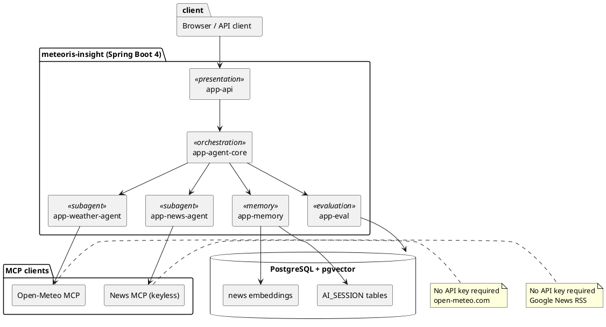
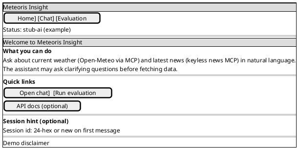
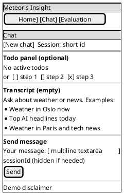
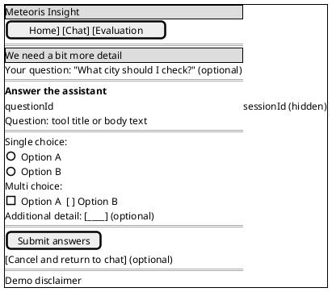
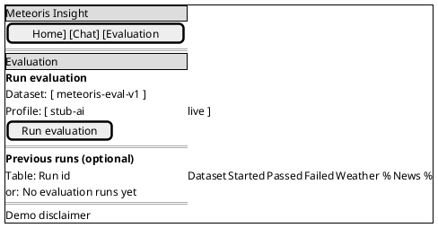

# Meteoris Insight — User guide

This guide is for **people using the running application** (browser or API clients). For installation, build commands, and developer setup, see the [repository README](https://github.com/berdachuk/ai-architect-6-agents/blob/main/README.md). For product requirements and terminology, see the [PRD](PRD.md).

---

## System overview

> **Figure 1** — High-level component topology. The orchestrator (`app-agent-core`) receives every chat turn and decides whether to call the weather sub-agent, the news sub-agent, or both, based on the user message. Memory, evaluation, and AskUser routing are also handled in the orchestrator layer. All data at rest lives in PostgreSQL + pgvector.

---

## What you can do

Meteoris Insight is a **web application** that answers questions by combining an **orchestrator** with tools for **weather**, **news**, optional **skills** and **todos**, and (in some setups) **session memory**. You can:

- Chat in the browser about **current weather** and **recent news**.
- Continue a conversation when the assistant asks you to **choose an option** (AskUser flow).
- Start a **new chat session** without losing the app.
- Run a **fixed evaluation dataset** from the UI and inspect a JSON summary (useful for coursework demos and regression checks).

Outputs are **demonstration-grade only** (see the disclaimer on interactive pages): not professional weather, news, financial, or legal advice.

---

## Getting started in the browser

1. Start **PostgreSQL** (for example `docker compose up -d` from the repo root), then start the app (see the [README](https://github.com/berdachuk/ai-architect-6-agents/blob/main/README.md) — typically `http://localhost:8080/`).
2. Open the **home** page at `/` for links and the active **Spring profile** name (for example `stub-ai` for deterministic behaviour in labs).
3. Go to **Chat** at `/chat`.

### Chat (`/chat`)

- Type a message and submit. Example prompts:
  - *What is the weather in Minsk today?*
  - *What are the latest news headlines about renewable energy?*
- The page may show a **reply** after redirect, your **session id** (hidden field), and an optional **todo** list if the agent updated tasks during the turn.

### New session

Use the control that submits **`action=NEW_SESSION`** (labelled along the lines of "New chat" on the chat page). That clears the **todo** state for the previous session, assigns a **new session id**, and reloads chat.

### When the assistant asks you to choose (AskUser)

If the orchestrator needs your input (for example picking a city or option):

1. You are shown **`/chat/answer`** with a **ticket id**, **prompt**, and **options**.
2. Select one or more options (or free text, if offered) and submit.
3. You return to **`/chat`** with the final **reply** in the query string.

Use the **same session** as the turn that triggered the question; the form carries **`sessionId`** and **`ticketId`**.

---

## Evaluation (`/evaluation`)

For reproducible checks against a **bundled YAML dataset** (not a free-form chat):

1. Open **`/evaluation`**.
2. Enter the **dataset** name (default bundled set: `meteoris-eval-v1`).
3. Choose or enter the **profile** (for local/CI-style runs, `stub-ai` is typical; with PostgreSQL + pgvector tests, `stub-ai,test-pgvector` may be used in automation).
4. Submit **Run evaluation**.

The next page shows a **JSON report** (pass/fail counts and per-case detail). Methodology and metrics are described in [Evaluation methodology](EVALUATION-METHODOLOGY.md).

**Command-line equivalent (no web UI):** see [README — Evaluation CLI](https://github.com/berdachuk/ai-architect-6-agents/blob/main/README.md#evaluation-cli-no-http-server).

---

## Screen walkthroughs

### Home (`GET /`)

### Chat (`GET /chat`) — empty state

### AskUser (`GET /chat/answer`)

### Evaluation (`GET /evaluation`)

---

## Using the REST API

Machine clients should follow **`meteoris-insight/api/openapi.yaml`** (OpenAPI 3). Typical operations:

| Goal | Method and path |
|------|-----------------|
| Create chat session | `POST /api/v1/chat/session` |
| Send a message | `POST /api/v1/chat/messages` |
| Answer an AskUser ticket | `POST /api/v1/chat/questions/{ticketId}/answers` |
| Run evaluation | `POST /api/v1/evaluation/run` |

Validation and business-rule errors are returned as **`application/problem+json`** (RFC 9457 style) where the API contract applies.

---

## Behaviour: stub vs live

- **`stub-ai` profile:** Weather and news responses come from **built-in stubs** (fast, deterministic, no external RSS or forecast calls). Ideal for **demos, CI, and coursework evidence**.
- **`local` profile (without `stub-ai`):** The app can call **Open-Meteo** for weather and **Google News RSS** for headlines, and use your **OpenAI-compatible** LLM configuration when set. See [README — Live LLM](https://github.com/berdachuk/ai-architect-6-agents/blob/main/README.md#live-llm-openai-compatible) and [README — Live integrations](https://github.com/berdachuk/ai-architect-6-agents/blob/main/README.md#live-integrations-no-api-keys).

The home and chat pages show **active profiles** so you can confirm which mode you are in.

---

## Session and privacy notes

- The browser **session id** is stored in a **cookie** (see server behaviour in [Forms and workflows](FORMS-AND-FLOWS.md)). It ties together chat turns, AskUser tickets, and todo state for that browser session.
- **Auto-memory** and other file-based features (if enabled) write under a configurable directory on the server — see the [README](https://github.com/berdachuk/ai-architect-6-agents/blob/main/README.md) and [PRD](PRD.md) for environment variables.

---

## Where to read next

| Topic | Document |
|-------|----------|
| Screen-by-screen forms and flows | [Forms and workflows](FORMS-AND-FLOWS.md) |
| Text wireframes and copy | [Wireframes](WIREFRAMES.md) |
| Architecture and modules | [Architecture](ARCHITECTURE.md) |
| Evaluation scoring and reporting | [Evaluation methodology](EVALUATION-METHODOLOGY.md) |
| Course submission checklist | [Submission folder](submission/README.md) |

---

## Getting help

For **bugs** or **incorrect API behaviour**, use your course or project issue tracker with the **active profiles**, **request path**, and (if safe to share) a **redacted** sample request/response. Do **not** paste real API keys into tickets or screenshots.
