# Meteoris Insight — Text wireframes

Low-fidelity **text wireframes** for the Thymeleaf demo UI. Aligned with [PRD.md](PRD.md) (**FR-9**, **NFR-6**), [FORMS-AND-FLOWS.md](FORMS-AND-FLOWS.md) (forms **F-xx** and flows), and [USE-CASES.md](USE-CASES.md). Per [AGENTS.md](AGENTS.md), each screen introduced with a **Screen:** heading is paired with a **PlantUML Salt** wireframe (`@startsalt` / `@endsalt`) directly underneath.

**Assumptions**

- Desktop-first, server-rendered Thymeleaf pages.
- Lightweight JavaScript only where needed (optional todo fragment poll, copy button).
- No SPA shell and no end-user accounts in v1.
- Every **interactive** page includes the **demo disclaimer** (not professional weather, news, financial, or legal advice).
- Product copy stays factual and demo-oriented; news headlines reflect MCP sources when available.

---

## 1. Global page shell

**Screen: Shared shell (all UI pages)**

- Header / navigation
    - [Brand link] Meteoris Insight
    - [Nav] Home | Chat | Evaluation
    - Optional status text: profile label (e.g. `local`, `stub-ai`) or environment badge

- Main content
    - Page-specific heading
    - Page-specific panels, forms, transcript, or tables

- Safety and provenance
    - Disclaimer: educational / demo only; not official forecasts or journalism
    - Optional text: MCP backends (Open‑Meteo, keyless news) for transparency
    - Optional model note: chat model id or stub name when configured

- Global behavior
    - Current page remains reachable by direct URL refresh
    - Forms submit with **HTTP POST** and re-render the server page (unless noted)
    - Long assistant replies scroll inside a bounded region to avoid infinite page height
    - Session continuity via cookie or hidden `sessionId` per [FORMS-AND-FLOWS.md](FORMS-AND-FLOWS.md)

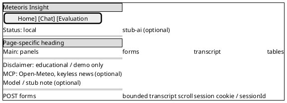

---

## 2. Home / landing

**Screen: Landing (`GET /`)**

- Header / navigation
    - [Brand link] Meteoris Insight
    - [Nav] Home | Chat | Evaluation

- Main content
    - Heading: Welcome to Meteoris Insight

    - Section: What you can do
        - Text: Ask about **current weather** (Open‑Meteo via MCP) and **latest news** (keyless news MCP) in natural language.
        - Text: The assistant may ask clarifying questions before fetching data.

    - Section: Quick links
        - [Link] Open chat
        - [Link] Run evaluation
        - Optional: [Link] API docs (external or `/swagger-ui` if enabled)

    - Section: Session hint (optional)
        - Text: Session id: [24-hex or “new on first message”]

- Footer
    - Demo disclaimer

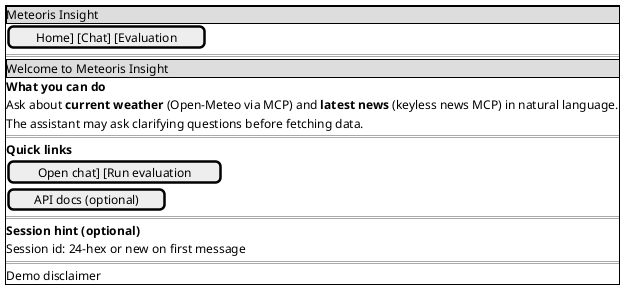

---

## 3. Chat (empty state)

**Screen: Chat (`GET /chat`)**

- Header / navigation
    - [Brand link] Meteoris Insight
    - [Nav] Home | Chat | Evaluation

- Main content
    - Heading: Chat

    - Toolbar (optional)
        - [Button] New chat (submits F-04 or dedicated POST)
        - Text: Session: [short id]

    - Section: Optional todo panel (if enabled)
        - Empty state: no active todos
        - Or list: [ ] step 1 | [~] step 2 | [x] step 3

    - Section: Transcript
        - Empty state:
            - Text: Ask about weather or news. Examples:
            - Bullet: “Weather in Oslo now”
            - Bullet: “Top AI headlines today”
            - Bullet: “Weather in Paris and tech news”

    - Form: Send message (**F-02**)
        - Field: Your message
            - Control: multiline textarea
            - Placeholder: Type your question…
        - Hidden: `sessionId` (if not using cookie-only)
        - [Button] Send

- Footer
    - Demo disclaimer

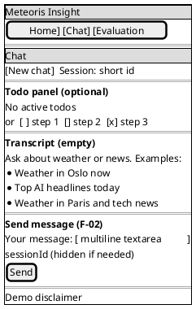

---

## 4. Chat (with transcript and last reply)

**Screen: Chat after turn (`POST /chat` success)**

- Header / navigation
    - (same as section 3)

- Main content
    - Heading: Chat

    - Toolbar
        - [Button] New chat
        - Text: Session: [id]

    - Section: Optional todo panel
        - Populated during multi-step runs (**U.10**)
        - List reflects TodoWriteTool states when wired

    - Section: Transcript (chronological)
        - Block: User — [prior message text]
        - Block: Assistant — [prior reply text]
        - …
        - Block: User — [latest message text]
        - Block: Assistant — [latest reply text]
            - Optional subline: Model: [model id]

    - Form: Send message
        - Field: Your message
            - Control: textarea
            - Value: cleared after successful send
        - [Button] Send

- Footer
    - Demo disclaimer

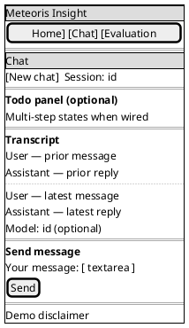

---

## 5. Chat — AskUser (structured question)

**Screen: AskUser (`GET /chat/answer` or redirect after interrupt)**

- Header / navigation
    - [Brand link] Meteoris Insight
    - [Nav] Home | Chat | Evaluation

- Main content
    - Heading: We need a bit more detail

    - Context strip (optional)
        - Text: Your question: “[truncated user message]”

    - Form: Answer the assistant (**F-03**)
        - Hidden: `questionId` or ticket id
        - Hidden: `sessionId`
        - Section: Question prompt
            - Text: [tool question title or body]

        - Branch: single choice
            - Radio group: ( ) Option A — [description]
            - Radio group: ( ) Option B — [description]

        - Branch: multi choice
            - Checkbox: [ ] Option A
            - Checkbox: [ ] Option B

        - Branch: free text (if allowed)
            - Field: Additional detail
                - Control: single-line or textarea

        - [Button] Submit answers
        - [Link] Cancel and return to chat (optional; clears pending tool at policy)

- Footer
    - Demo disclaimer

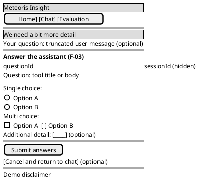

**Screen: AskUser validation error (`POST /chat/answer` with missing required selection)**

- Same layout as above
    - Banner: Please select at least one option (or field-specific message)
    - Previously selected values preserved where applicable

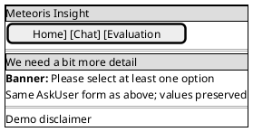

---

## 6. Chat — error and loading states

**Screen: Chat with MCP or LLM error (`POST /chat` failure)**

- Header / navigation
    - (same)

- Main content
    - Heading: Chat

    - Banner (error)
        - Text: We could not reach the weather service. Please try again in a moment. (**U.13**, **N.01**)
        - Or: The news service returned no articles for this query. (**N.03**)
        - Or: The AI service is temporarily unavailable. (**N.04**)

    - Section: Transcript
        - Prior turns unchanged
        - Optional: last user message shown without assistant block

    - Form: Send message
        - Field: Your message — editable
        - [Button] Send

- Footer
    - Demo disclaimer

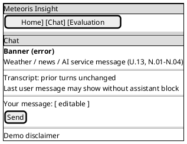

**Screen: Chat with validation error (empty message)**

- Banner: Please enter a message.
- Transcript unchanged

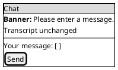

---

## 7. Evaluation

**Screen: Evaluation form (`GET /evaluation`)**

- Header / navigation
    - [Brand link] Meteoris Insight
    - [Nav] Home | Chat | Evaluation

- Main content
    - Heading: Evaluation

    - Form: Run evaluation (**F-05**)
        - Field: Dataset
            - Control: text or select
            - Default: meteoris-eval-v1 (example)
        - Field: Profile
            - Control: select
            - Options: stub-ai | live (if documented)
        - [Button] Run evaluation

    - Section: Previous runs (optional)
        - Table: Run id | Dataset | Started | Passed | Failed | Weather pass % | News pass %
        - Empty state:
            - Text: No evaluation runs yet

- Footer
    - Demo disclaimer

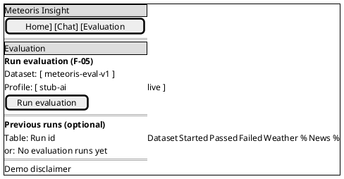

**Screen: Evaluation result (`POST /evaluation/run` success)**

- Header / navigation
    - (same)

- Main content
    - Heading: Evaluation

    - Form: Run evaluation
        - Fields show submitted values
        - [Button] Run evaluation

    - Section: Latest run
        - Text: Run id: [24-hex id]
        - Metric: Total cases: [n]
        - Metric: Passed: [n] | Failed: [n]
        - Metric: Weather pass rate: [0–1 or %]
        - Metric: News pass rate: [0–1 or %]
        - Optional: [Link] Download failed cases JSON (**E.06**)

    - Section: Previous runs
        - Table with current run highlighted

- Footer
    - Demo disclaimer

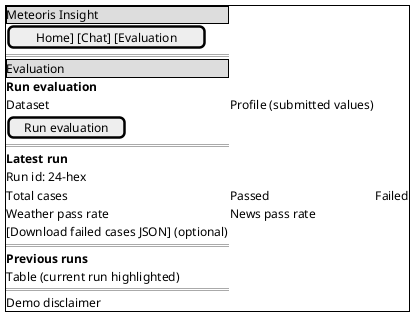

**Screen: Evaluation error**

- Banner: [dataset not found | runner failure | validation]
- Form remains editable

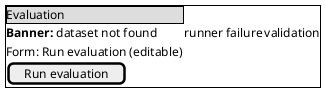

---

## 8. Error page (generic)

**Screen: Error (e.g. `GET /error` or MVC error view)**

- Header
    - [Brand link] Meteoris Insight

- Main content
    - Heading: Something went wrong
    - Message: [safe user-facing message; no stack trace]
    - [Link] Back to home
    - Optional: [Link] Open chat

- Footer
    - Demo disclaimer

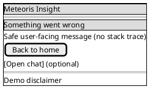

---

## 9. Responsive note

- Main content stacks vertically on narrow viewports.
- Form controls use full row width on small screens.
- Transcript and tables scroll horizontally if needed rather than clipping ids.
- Optional todo panel collapses below the message form on mobile.

---

## 10. Traceability

| Wireframe | Route | Forms doc | Use cases | PRD |
|-----------|-------|-----------|-----------|-----|
| Global page shell | all UI pages | Global UI rules | U.01–U.15 | NFR-6, FR-9 |
| Home / landing | `/` | F-01 | U.01 | FR-9 |
| Chat empty | `/chat` | F-02 | U.01, U.02–U.07 | FR-5, FR-9 |
| Chat with reply | `/chat` (POST) | F-02 | U.04–U.12 | FR-1–FR-4, FR-6 |
| AskUser | `/chat/answer` | F-03 | U.02, U.03, A.04 | FR-5 |
| Chat errors | `/chat` | F-02 | U.13, N.01–N.04 | FR-2, FR-3 |
| Evaluation | `/evaluation` | F-05 | E.03, E.06 | FR-10 |
| Error page | error view | n/a | support | NFR-5 |

---

**Document version:** 1.1. Update when Thymeleaf templates, routes, or the page inventory changes; keep each **Screen:** block paired with PlantUML Salt per [AGENTS.md](AGENTS.md).
